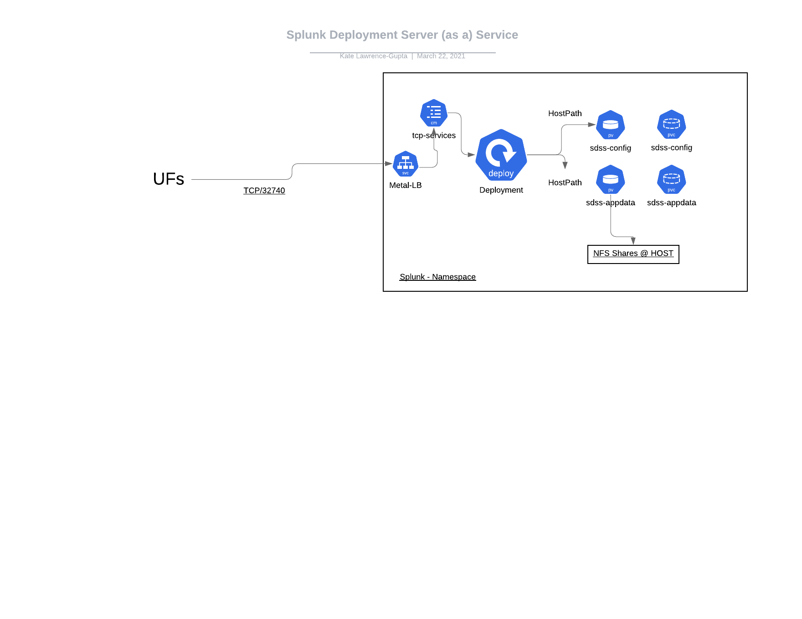

**Readme Splunk Deployment Server Service** -  Microk8s/Kubernetes cluster strategy + MetalLB

This deployment is currently tested with Ubuntu 18.04 using microk8s version 1.19 

**scripts** - Run in order & follow echo statements as needed
 * build_microk8s_1.19.sh - build script to deploy a microk8s cluster & kubectl for a single node but with HA as an available option
 * mk8.sh - enables storage, dns & metalLB addons
 * scripts/build_sdss.sh - build script to deploy the following
* -- configmap.yaml - TCP services configmap
* -- lb.yaml - LoadBalancer service setting a open proxy address for HOST_IP:32740
* -- sdss.yaml - deploy full Splunk image & configure
* -- pv-appdata.yaml - NFS volume for /etc/deployment-apps directory
* -- pvc- appdata - persistant volume claim for /etc/deployment-apps directory
* -- pv-config  - NFS volume for /etc/apps/sdss_config
* -- pvc-config - persistant volume cliam for /etc/apps/sdss_config
* -- iptables.sh  - set IPTABLES rules to allow traffic on TCP/32740 *optional depending on enviroment
*!! enable_ds.sh - enables the DS feature on all pods deployed through the CLI

**Install Overview**
The 2 scripted installs will deploy the following:
* build_microk8s_1.19.sh -- Microk8s cluster w/ storage, dns & MetalLB addons enabled
* build_sdss.sh -- A TCP Configmap + MetalLB LoadBalancer Service on default port TCP/32740
    > 2 NFS mounts in RW/Many mode for
    >> * /opt/splunk/etc/apps/sdss_config <- serverclass.conf configurations
    >> * /opt/splunk/etc/deployment-aps <- deployment app configuration data
    >> !! * **enable_ds.sh - enables the DS feature on all pods deployed through the CLI - UFS won't connect to the deployed replica nodes until this has been run.**
    
**Operations -- Replicas can be scaled up/down as needed** 
* kubectl scale --replicas=0 -f mds.yaml //down
* kubectl scale --replicas=6 -f mds.yaml //up
* **sh enable_ds.sh should be run after any scaling action to enable the DS per POD**

